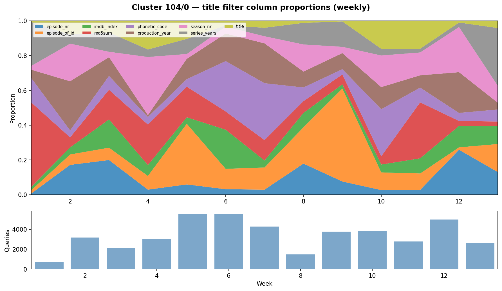
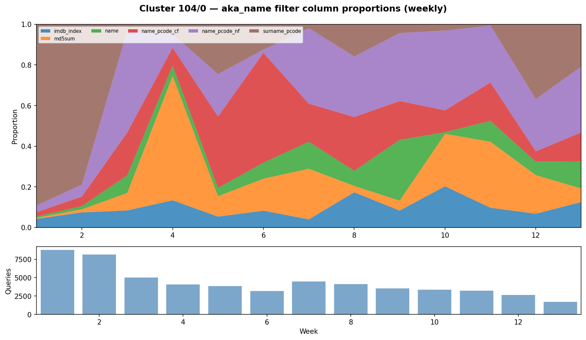
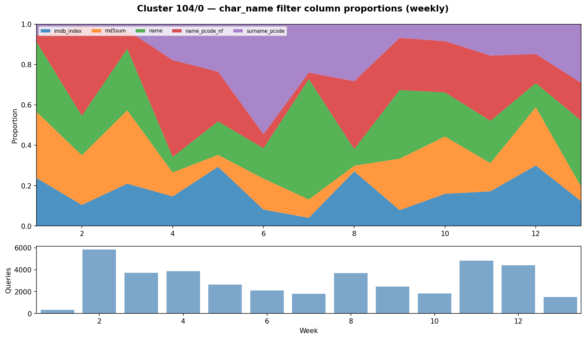
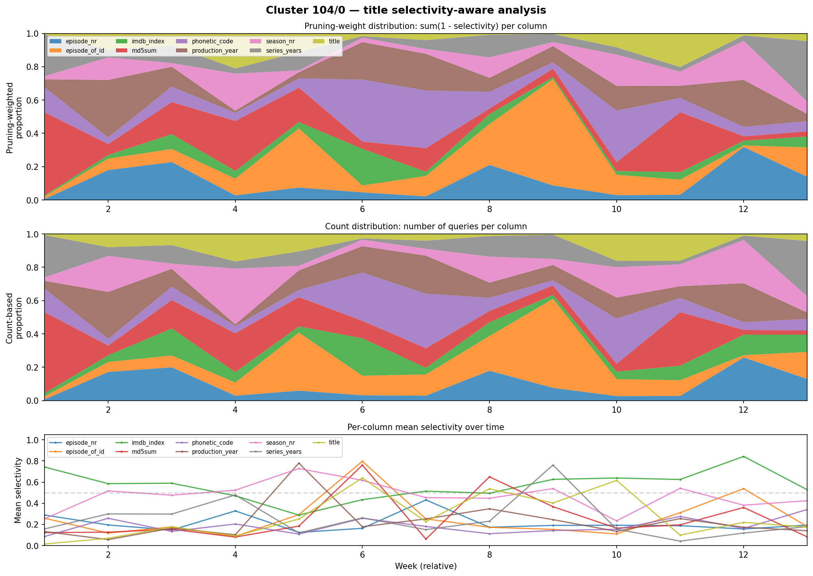
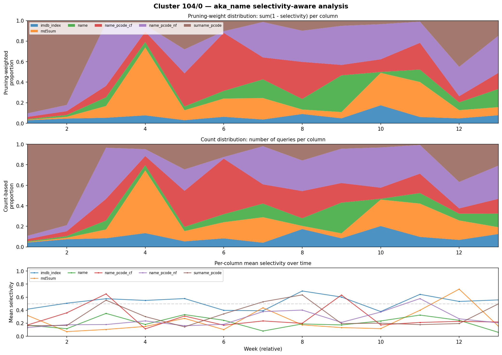
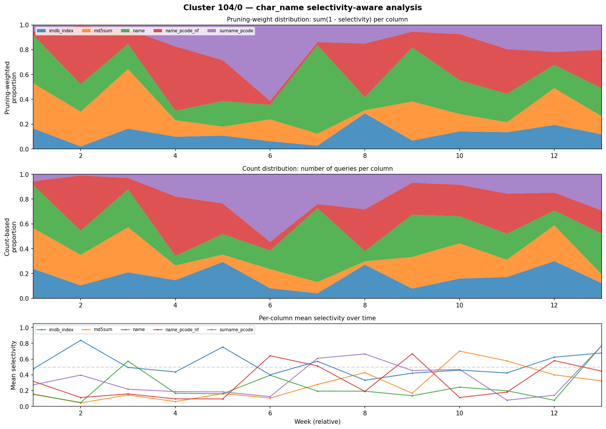
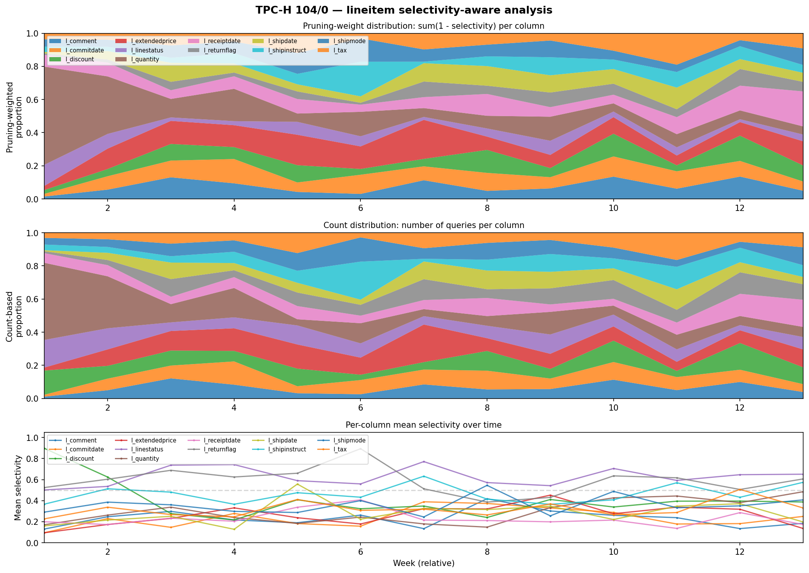
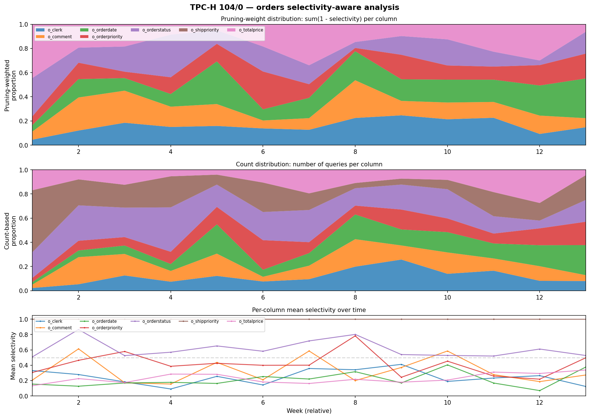
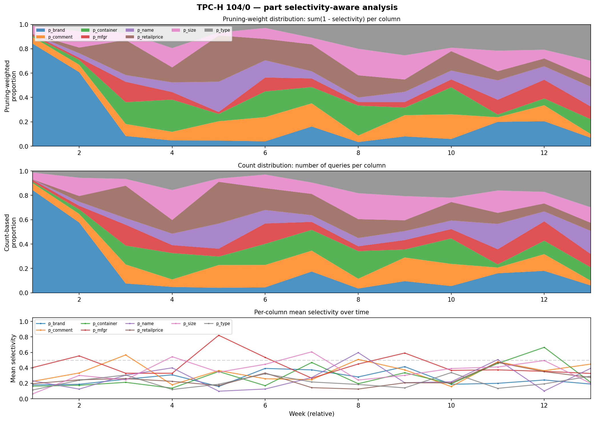

# Redbench Workload Analysis: Filter Diversity and Temporal Patterns

## Table of Contents

1. [Executive Summary](#executive-summary)
2. [Background and Motivation](#background-and-motivation)
3. [Experimental Setup](#experimental-setup)
4. [Best Clusters and Tables](#best-clusters-and-tables)
   - [IMDB: Cluster 104](#imdb-cluster-104)
   - [TPC-H: Cluster 104](#tpc-h-cluster-104)
   - [IMDB vs TPC-H](#imdb-vs-tpc-h)
5. [Cross-Cluster Comparison](#cross-cluster-comparison)
   - [IMDB Clusters](#imdb-clusters)
   - [TPC-H Clusters](#tpc-h-clusters)
   - [Selectivity-Aware Ranking](#selectivity-aware-ranking)
6. [Provisioned Cluster Results](#provisioned-cluster-results)
   - [Provisioned vs Serverless Comparison](#provisioned-vs-serverless-comparison)
   - [Why Provisioned Cluster 158 Has Higher JSD](#why-provisioned-cluster-158-has-higher-jsd)
   - [Volume Caveat](#volume-caveat)
   - [Recommendation](#recommendation)
7. [Periodic Workload Analysis for Sort Key Optimization](#periodic-workload-analysis-for-sort-key-optimization)
   - [Motivation](#motivation)
   - [Methodology](#methodology)
   - [Results: Category Distribution](#results-category-distribution)
   - [Results: Serverless Cluster 104](#results-serverless-cluster-104)
   - [Results: High-Volume Clusters](#results-high-volume-clusters)
   - [Results: Provisioned Clusters](#results-provisioned-clusters)
   - [Implications for Sort Key Optimization](#implications-for-sort-key-optimization)
8. [Matching Workload Analysis](#matching-workload-analysis)
   - [IMDB Matching](#imdb-matching)
   - [TPC-H Matching](#tpc-h-matching)
   - [Why Matching Underperforms Generation](#why-matching-underperforms-generation)
9. [Discussion](#discussion)
   - [Why Generation Produces Temporal Drift](#why-generation-produces-temporal-drift)
   - [Selectivity Model and Limitations](#selectivity-model-and-limitations)
   - [Dataset Choice: TPC-DS and Beyond](#dataset-choice-tpc-ds-and-beyond)
10. [Appendix](#appendix)
   - [A. Jensen-Shannon Divergence](#a-jensen-shannon-divergence)
   - [B. IMDb Table Sizes](#b-imdb-table-sizes)
   - [C. Redbench Filter Generation Details](#c-redbench-filter-generation-details)
   - [D. Per-Cluster Detailed Results](#d-per-cluster-detailed-results)
   - [E. TPC-H Matching Implementation](#e-tpc-h-matching-implementation)
   - [F. Reproduction Steps](#f-reproduction-steps)

---

## Executive Summary

This report evaluates whether Redbench can generate benchmark workloads with realistic temporal drift in filter patterns, suitable for evaluating a system that dynamically adapts table clustering/layout in response to workload changes.

We measure temporal variability using the pruning-weighted Jensen-Shannon Divergence (JSD), which quantifies how much the distribution of filtered columns on a given table shifts from one time period to the next. A JSD of 0 means the filter mix is perfectly static; the theoretical maximum is sqrt(ln 2) ~ 0.833, representing completely non-overlapping distributions. The "pruning-weighted" variant weights each filter observation by `(1 - selectivity)`, so filters with low selectivity (passing few rows, allowing most of the table to be pruned) contribute more than near-full-table scans. See [Appendix A](#a-jensen-shannon-divergence) for the formal definition.

**Key findings:**

- Redbench's generation-based synthesis produces workloads with meaningful temporal variation in per-table filter distributions. The matching-based mode is too repetitive to be useful -- this holds across all clusters and both datasets tested.
- Temporal dynamics come entirely from the Redset QIG (Query Instance Group) composition over time, not from the benchmark dataset. The benchmark (IMDB vs TPC-H) only determines the schema and table sizes.
- Cluster 104 is the best Redset cluster for both IMDB and TPC-H, combining high query volume with the strongest proportional filter shifts.

**Best workload configurations (all generation-based, cluster 104):**

| Dataset | Table | Queries/day | Filter Cols | Daily Weighted JSD | Scalable? |
|---------|-------|-------------|-------------|-------------------|-----------|
| IMDB | title | 483 | 9 | 0.580 | No (2.5M rows fixed) |
| IMDB | aka_name | 617 | 6 | 0.491 | No (901K rows fixed) |
| IMDB | char_name | 429 | 5 | 0.490 | No (3.1M rows fixed) |
| TPC-H | lineitem | 3,599 | 12 | 0.426 | Yes (600M rows at SF=100) |
| TPC-H | orders | 1,072 | 7 | 0.455 | Yes (150M rows at SF=100) |
| TPC-H | part | 1,408 | 8 | 0.459 | Yes (20M rows at SF=100) |

**Recommended approach:** Use IMDB cluster 104 for the strongest temporal dynamics (highest JSD), and TPC-H cluster 104 at higher scale factors for performance-sensitive evaluation where table size matters. Provisioned Redset cluster 158 achieves even higher JSD (0.743 for `title`, vs 0.580 for serverless cluster 104) but at lower per-day volume; see [Provisioned Cluster Results](#provisioned-cluster-results).

**Important realism caveat:** Generation produces filter diversity by round-robin cycling through all columns of each mapped table. This means the number of distinct filter columns per table is close to the total number of columns in that table, and every column gets filtered on with roughly equal long-run frequency. Real workloads typically concentrate filters on a small subset of columns (e.g., date columns, primary keys). This is a significant limitation, but largely unavoidable: Redset does not include column-level access statistics, so there is no signal to determine which columns a real query filtered on. The temporal *shift* patterns (which columns dominate in which time periods) are still realistic, since they derive from real Redset QIG timing.

**Periodic workload analysis:** A train/test evaluation framework classifies each table's workload by which prediction model (static average, periodic floor, or periodic average) best forecasts the held-out second half. Using test-set L1 error (workload characterization), 60% of 178 tables are nonstationary, 31% have a periodic floor, and 10% are fully stationary. However, when measured by sort key regret (model selected on the train set, evaluated on the test set), no periodic model beats the static baseline — the static model's sort key choice is already nearly optimal (median regret 0.074 vs 0.079 for the best periodic model). Periodic structure is real and detectable by L1, but the sort key decision is too coarse (pick one column) for periodic models to improve on "pick the globally best column." See [Periodic Workload Analysis for Sort Key Optimization](#periodic-workload-analysis-for-sort-key-optimization).

---

## Background and Motivation

We are investigating whether Redbench can generate workloads suitable for evaluating a system that dynamically decides when and whether to change a table's physical layout or clustering in response to workload changes. For meaningful evaluation, we need benchmark workloads where:

1. Different tables are filtered on different columns over time
2. The relative frequency of filtered columns changes (i.e., the workload *drifts*)
3. There is sufficient query volume per table to make clustering decisions non-trivial

### Redset

Redset is a public dataset of anonymized query metadata from Amazon Redshift Serverless. The serverless subset contains 8.2 million queries across 200 clusters, spanning a 3-month window (March--May 2024). Each record includes arrival timestamp, query type, table access metadata (`read_table_ids`, `mbytes_scanned`), and structural features -- but not the SQL text itself.

The 200 clusters are highly skewed in size: 134 have fewer than 100 queries, 88 have fewer than 10, and only 25 exceed 10,000 queries. The largest cluster (134) has 1.5M queries. Query types are diverse: INSERT (36%), SELECT (26%), COPY (13%), DELETE (9%), and others. Only SELECTs are relevant for our filter-pattern analysis.

### Redbench

Redbench synthesizes executable SQL workloads from Redset traces by mapping them onto benchmark schemas (IMDB/JOB/CEB, TPC-DS, TPC-H). It operates in two modes:

- **Matching**: maps each Redset query to the most structurally similar query from a benchmark's template library (e.g., TPC-H's 22 templates), preserving the original query's arrival timestamp.
- **Generation**: uses the Redset query's structural features (number of joins, scans, table access patterns) to synthesize new SQL against the benchmark schema, cycling through all columns as potential filter targets.

In both modes, the temporal dynamics come entirely from the Redset Query Instance Group (QIG) composition over time. A QIG is defined by `(query_type, num_joins, num_aggregations, read_table_ids, write_table_ids, feature_fingerprint, database_id, instance_id)`. Different QIGs dominate in different time periods, and since each QIG deterministically selects a filter column or template, the table-level filter distribution shifts as the dominant QIG changes.

### Cluster Selection

Of the 200 Redset clusters, we selected the most promising ones through a filtering process:

1. **SELECT volume**: Only SELECTs with non-null `read_table_ids` and `mbytes_scanned` are usable by Redbench. Of 2.17M total SELECTs, only 1.07M (49%) pass this filter.

2. **Minimum volume threshold**: We targeted clusters with at least a few thousand usable SELECTs. This narrowed the field to ~12 clusters.

3. **Evaluated clusters**: We ran generation on 10 clusters. Each Redset cluster can contain multiple databases; we use database 0 throughout (the primary database in each cluster). Two additional candidates (80 and 24) had 0 usable SELECTs despite having 66K and 19K total SELECTs respectively -- all their SELECTs had null `read_table_ids`.

| Cluster | Total Queries | Usable SELECTs | Notes |
|---------|--------------|----------------|-------|
| 134 | 1,520,191 | 55,442 | Largest cluster overall; 91% of SELECTs lack table metadata |
| 104 | 1,059,735 | 338,382 | Highest usable SELECT count |
| 55 | 666,634 | 317,416 | High volume, nearly all SELECTs usable |
| 85 | 395,374 | 193,843 | |
| 19 | 893,475 | 17,023 | Low usable rate (5% of SELECTs) |
| 128 | 516,113 | 677 | Nearly all SELECTs lack table metadata |
| 105 | 108,972 | 6,312 | |
| 126 | 151,418 | 53,374 | |
| 129 | 353,449 | 32,859 | Write-heavy (9% SELECTs) |
| 0 | 127,673 | 2,719 | Write-heavy, minimal SELECTs |

## Experimental Setup

- **Redset source**: Serverless dataset (`full_serverless.parquet`), 10 clusters evaluated
- **Time range**: March 1 -- May 30, 2024 (~91 days)
- **Query types**: SELECT only
- **Benchmark datasets**: IMDB (JOB + CEB, 21 tables, 74.2M rows) and TPC-H SF=1 (8 tables, 8.6M rows)
- **Synthesis modes**: Generation for all 10 clusters on both IMDB and TPC-H; matching for clusters 0, 85, and 104 on IMDB, and cluster 104 on TPC-H

Minor implementation parameters (defaults were adjusted for broader coverage but do not materially affect the analysis): schema augmentation factor 2 (creates `_0` and `_1` copies of each table for broader Redset mapping; we merge them in analysis), quantile resolution 1,000 buckets (up from default 100), selectivity floor disabled (`min_table_scan_selectivity = 0`).

Note on query counts: the number of generated queries can differ from the number of usable Redset SELECTs for two reasons. First, the schema augmentation (factor 2) means a single Redset SELECT can map to queries against both the `_0` and `_1` table copies, roughly doubling the count for some clusters (e.g., cluster 55: 317K usable SELECTs produce 631K generated queries). Second, the generation pipeline's QIG-to-table mapping can also reduce counts when multiple Redset SELECTs share a QIG and produce the same generated query.

---

## Best Clusters and Tables

Across all clusters and both datasets, cluster 104 consistently produces the strongest combination of high query volume and temporal filter drift. This section presents the headline results.

### IMDB: Cluster 104

Cluster 104 generates 340,693 queries over 91 days (3,744/day) across 20 IMDB tables with 62 distinct (table, column) filter pairs. The top tables for dynamic clustering evaluation:

| Table | Queries | q/day | Filter Cols | Daily JSD (count) | Daily JSD (weighted) | Mean Sel |
|-------|---------|-------|-------------|-------------------|---------------------|----------|
| title | 43,930 | 483 | 9 | 0.573 | 0.580 | 0.298 |
| aka_name | 56,154 | 617 | 6 | 0.479 | 0.491 | 0.296 |
| char_name | 39,067 | 429 | 5 | 0.482 | 0.490 | 0.317 |
| movie_info | 49,709 | 546 | 3 | 0.318 | 0.347 | 0.310 |
| aka_title | 1,740 | 19 | 10 | 0.415 | — | — |
| name | 1,451 | 16 | 7 | 0.370 | — | — |

The `title` table is the standout: 483 queries/day across 9 filter columns with a daily weighted JSD of 0.580 (70% of the theoretical maximum). This means the filter column distribution shifts substantially from day to day. Three tables (`title`, `aka_name`, `char_name`) each exceed 400 queries/day with daily JSD > 0.47.

The mechanism driving this variability: different Redset QIGs are temporally bursty -- a given QIG appears heavily for a few days then fades, replaced by a different QIG. Since each QIG deterministically selects a specific filter column, the table-level filter distribution shifts as the dominant QIG changes.

The proportional shift plots below show how the relative frequency of filtered columns changes over time at daily granularity:

**title** -- 43,930 queries, 9 filter columns, daily weighted JSD 0.580:


**aka_name** -- 56,154 queries, 6 filter columns, daily weighted JSD 0.491:


**char_name** -- 39,067 queries, 5 filter columns, daily weighted JSD 0.490:


The selectivity-weighted timeline plots show the same data reweighted by pruning benefit `(1 - selectivity)`:

**title** -- selectivity-weighted view:


**aka_name** -- selectivity-weighted view:


**char_name** -- selectivity-weighted view:


### TPC-H: Cluster 104

TPC-H is valuable not for more temporal variability (which comes from Redset), but for scalable table sizes. IMDB is a fixed-size dataset (~74M rows), while TPC-H scales arbitrarily (SF=100 gives `lineitem` at 600M rows).

Query counts are identical between TPC-H and IMDB for every cluster (340,693 for cluster 104), confirming that volume is determined entirely by the Redset QIG composition, not the benchmark dataset.

| Table | Queries | q/day | Filter Cols | Daily JSD (count) | Daily JSD (weighted) | Mean Sel | Rows at SF=100 |
|-------|---------|-------|-------------|-------------------|---------------------|----------|----------------|
| lineitem | 327,501 | 3,599 | 12 | 0.391 | 0.426 | 0.360 | 600M |
| part | 128,137 | 1,408 | 8 | 0.443 | 0.459 | 0.291 | 20M |
| orders | 97,565 | 1,072 | 7 | 0.457 | 0.455 | 0.447 | 150M |
| supplier | 110,948 | 1,219 | 5 | 0.384 | 0.390 | 0.281 | 1M |
| customer | 7,280 | 80 | 6 | 0.389 | — | — | 15M |
| partsupp | 3,081 | 34 | 3 | 0.022 | — | — | 80M |

TPC-H's `lineitem` table has the highest column diversity of any table across both datasets (12 filter columns) and the highest query volume (3,599/day). Its JSD (0.43 weighted) is lower than IMDB's `title` (0.58), but the much higher volume and scalability compensate.

**lineitem** -- selectivity-weighted view:


**orders** -- selectivity-weighted view:


**part** -- selectivity-weighted view:


### IMDB vs TPC-H

| Metric | IMDB (cluster 104) | TPC-H (cluster 104) |
|--------|-------------------|---------------------|
| Total queries | 340,693 | 340,693 |
| Tables with >=2 filter cols | 10 | 6 |
| Best table (volume x JSD) | title (483/day, wJSD 0.58) | orders (1,072/day, wJSD 0.46) |
| 2nd best | aka_name (617/day, wJSD 0.49) | part (1,408/day, wJSD 0.46) |
| 3rd best | char_name (429/day, wJSD 0.49) | lineitem (3,599/day, wJSD 0.43) |
| Max filter columns | 10 (aka_title) | 12 (lineitem) |
| Largest table | 36M rows (cast_info) | 6M rows (lineitem, SF=1) |
| Scalable? | No (fixed dataset) | Yes (SF=100 -> 600M) |

IMDB has higher JSD values (0.49--0.58 vs 0.43--0.46), meaning more dramatic day-to-day filter shifts. TPC-H has lower JSD because its 8 tables (vs IMDB's 21) mean each table receives a larger share of the total query volume, and with more queries per table per day, the daily filter distributions are more stable (less sampling noise) and the round-robin cycling averages out more evenly within each day. For the same reason, TPC-H has substantially higher per-table query volumes (1,000--3,600/day vs 430--620/day): the same total query count is spread across fewer tables, so each table naturally gets more queries. TPC-H also offers arbitrary scalability via the scale factor.

**Recommendation:** Use IMDB cluster 104 for the strongest temporal dynamics. Use TPC-H cluster 104 at higher scale factors (SF=10 or SF=100) for performance-sensitive evaluation where table size matters.

---

## Cross-Cluster Comparison

All 10 clusters were evaluated on both IMDB and TPC-H. Since temporal dynamics come from the Redset QIG composition (not the benchmark dataset), the same cluster produces the same query volume and timing patterns regardless of whether it maps onto IMDB or TPC-H. The benchmark only determines which tables and columns appear.

### IMDB Clusters

The table below shows the best table per cluster, ranked by daily weighted JSD (selectivity-weighted where available). Clusters 126 and 129 did not have selectivity-weighted analysis run; their count-based JSD values are shown instead.

| Cluster | Best Table | Queries | q/day | Filter Cols | Daily wJSD | Mean Sel | Notes |
|---------|-----------|---------|-------|-------------|-----------|----------|-------|
| 104 | title | 43,930 | 483 | 9 | 0.580 | 0.298 | Best overall |
| 134 | title | 5,614 | 62 | 9 | 0.547 | 0.312 | Low volume |
| 55 | title | 63,476 | 698 | 9 | 0.316 | 0.310 | High volume, moderate JSD |
| 85 | title | 19,476 | 214 | 9 | 0.430 | 0.305 | |
| 19 | title | 1,714 | 19 | 9 | 0.501 | 0.320 | Very low volume |
| 128 | title | 78 | 0.9 | 9 | 0.728* | 0.310 | Negligible volume |
| 105 | title | 1,204 | 13 | 9 | 0.520 | 0.315 | Low volume |
| 0 | title | 274 | 3 | 9 | 0.573 | 0.305 | Negligible volume |
| 126 | title | 5,374 | 59 | 9 | 0.400** | -- | Count-based JSD only |
| 129 | title | 140 | 1.5 | 5 | 0.450** | -- | Count-based JSD only |

*Cluster 128's high JSD is an artifact of extremely low volume (< 1 query/day), making daily distributions noisy.
**Clusters 126 and 129 show count-based JSD (not selectivity-weighted). We did not run selectivity-weighted analysis for these clusters because their low volume makes them poor candidates regardless.

Key observations:
- Every cluster's best IMDB table is `title` -- this is because `title` has the most filter columns (9) and receives the most diverse QIG mappings.
- Cluster 104 is the clear winner: it combines the highest volume among high-JSD clusters (483/day) with the strongest weighted JSD (0.580).
- Cluster 55 has the highest volume (698/day) but lower JSD (0.316), meaning its filter distribution is more stable over time.
- Clusters with fewer than ~50 queries/day (128, 0, 129, 19, 105) are impractical for clustering evaluation because daily distributions are too noisy.

### TPC-H Clusters

The same ranking for TPC-H, showing the best table per cluster:

| Cluster | Best Table | Queries | q/day | Filter Cols | Daily wJSD | Mean Sel |
|---------|-----------|---------|-------|-------------|-----------|----------|
| 104 | part | 128,137 | 1,408 | 8 | 0.459 | 0.291 |
| 134 | lineitem | 29,413 | 323 | 12 | 0.638 | 0.544 |
| 55 | part | 125,200 | 1,376 | 8 | 0.317 | 0.448 |
| 85 | customer | 5,676 | 62 | 6 | 0.303 | 0.179 |
| 19 | part | 2,558 | 28 | 8 | 0.613 | 0.869 |
| 128 | orders | 77 | 0.8 | 7 | 0.741 | 0.656 |
| 105 | lineitem | 6,166 | 68 | 12 | 0.568 | -- |
| 0 | lineitem | 1,033 | 11 | 12 | 0.601 | -- |
| 126 | lineitem | 44,080 | 484 | 12 | 0.116 | -- |

Note: Clusters 105, 0, and 126 show count-based JSD for their best table because the selectivity-weighted analysis was only completed for the top-ranked clusters. Cluster 129 is omitted from TPC-H because its 1,386 total queries produce negligible per-table volume.

The TPC-H ranking largely mirrors IMDB: cluster 104 dominates on the volume-times-JSD metric, while clusters 134 and 19 show higher raw JSD but at much lower volumes.

### Selectivity-Aware Ranking

The selectivity-weighted JSD consistently exceeds the count-based JSD for the best tables, typically by 0.01--0.07 points. This means that filters with low selectivity (i.e., filters that pass very few rows and thus benefit most from clustering, since they allow pruning most of the table) tend to shift more across time periods than high-selectivity filters that scan most of the table. The effect is most pronounced for TPC-H cluster 134's `lineitem` (+0.066) and IMDB cluster 104's `title` (+0.007).

For the recommended configurations (cluster 104 on both datasets), the selectivity weighting confirms rather than changes the ranking -- the same tables that rank highest by count-based JSD also rank highest by weighted JSD.

---


## Provisioned Cluster Results

In addition to the serverless Redset clusters analyzed above, we evaluated five provisioned Redset clusters. The provisioned subset of Redset contains a separate set of clusters with generally higher query volumes (millions of usable SELECTs per cluster, vs hundreds of thousands for the largest serverless clusters). We selected the top 5 provisioned clusters by usable SELECT count: 158 (9.1M), 4 (5.9M), 49 (5.5M), 109 (4.5M), and 100 (4.0M).

Because these clusters are too large to process in full, we uniformly sampled 500,000 rows per cluster across the full 3-month time range (rather than taking the first N rows, which would truncate the time coverage). The sampled data was then run through the same IMDB generation pipeline used for serverless clusters.

### Provisioned vs Serverless Comparison

| Cluster | Type | Best Table | Queries | q/day | Cols | Daily wJSD | Mean Sel |
|---------|------|-----------|---------|-------|------|-----------|----------|
| 158 | Prov | title | 5,762 | 63 | 9 | 0.743 | 0.145 |
| 100 | Prov | title | 962 | 11 | 9 | 0.501 | 0.569 |
| 4 | Prov | aka_title | 1,005 | 11 | 10 | 0.422 | 0.664 |
| 49 | Prov | title | 17,497 | 192 | 9 | 0.278 | 0.241 |
| 109 | Prov | aka_title | 3,448 | 38 | 10 | 0.261 | 0.548 |
| **104** | **Srvl** | **title** | **43,930** | **483** | **9** | **0.580** | **0.298** |

Provisioned cluster 158 achieves the highest daily weighted JSD of any cluster tested (0.743 for `title`, vs 0.580 for serverless cluster 104). This is 89% of the theoretical maximum (0.833). The top 3 tables for cluster 158:

| Table | Queries | q/day | Filter Cols | Daily wJSD | Mean Sel |
|-------|---------|-------|-------------|-----------|----------|
| title | 5,762 | 63 | 9 | 0.743 | 0.145 |
| aka_name | 5,878 | 65 | 6 | 0.650 | 0.125 |
| char_name | 7,700 | 85 | 5 | 0.614 | 0.145 |

All three tables exceed the best serverless JSD values (0.580, 0.491, 0.490 respectively for the same tables on serverless cluster 104).

### Why Provisioned Cluster 158 Has Higher JSD

The higher JSD in cluster 158 is driven by more extreme QIG burstiness: the dominant QIGs change more abruptly between days, producing sharper shifts in the filter column distribution. The lower per-table query volume (63/day vs 483/day for serverless cluster 104) also contributes -- with fewer queries per day, each day's distribution is more sensitive to which specific QIGs happen to fire, amplifying the measured JSD.

This is a double-edged sword: the higher JSD makes cluster 158 a more challenging test case for a dynamic clustering system, but the lower volume means the system has less signal per decision window. Whether this tradeoff is favorable depends on the system's decision frequency and minimum sample size requirements.

### Volume Caveat

The query volumes shown above are based on a 500K-row sample of each provisioned cluster. The full clusters contain millions of usable SELECTs, so running the generation pipeline on the full data would produce proportionally higher query volumes. For example, cluster 158 has 9.1M usable SELECTs vs the 500K sampled, suggesting full-data generation could yield roughly 18x more queries per day. However, the JSD values would likely decrease with higher volume (more queries per day means more stable daily distributions), following the same pattern seen between high-volume and low-volume serverless clusters.

Provisioned cluster 49 illustrates this: it has the highest per-table volume among provisioned clusters (192/day for `title`) but the lowest JSD (0.278), consistent with the volume-JSD tradeoff observed in serverless clusters.

### Recommendation

Provisioned cluster 158 is the strongest candidate if the goal is to maximize temporal variability in filter patterns, even at the cost of lower per-day query volume. For a balanced volume-and-variability profile, serverless cluster 104 remains the best choice. Both could be used together: cluster 158 for stress-testing adaptation speed, and cluster 104 for steady-state evaluation with higher statistical confidence.

---


## Periodic Workload Analysis for Sort Key Optimization

### Motivation

The JSD analysis in previous sections measures *how much* the filter distribution shifts between consecutive time windows, but does not address a more practical question: can we predict these shifts well enough to optimize sort keys proactively? If a table's filtering workload follows a predictable daily or weekly cycle, a system could schedule sort key changes to track the cycle. If the workload is unpredictable, the best strategy is a static sort key based on the overall average.

This section frames the question as a forecasting problem. We build three models of increasing complexity, evaluate each on held-out data, and classify each table by which model best predicts its future workload. The classification directly determines the optimization strategy.

### Methodology

**Skipping volume vectors.** For each table, we construct a time series at 6-hour granularity. Each observation is a vector where component *i* is the total skipping volume for column *i* during that 6-hour bin — this is the same pruning-weighted volume used throughout this report, `sum(1 − selectivity)`, aggregated per column per bin. We use 6-hour bins rather than hourly to avoid sparsity (many hours have zero queries for a given column, which collapses quantile-based models). For a 91-day observation window, this produces ~364 bins per table.

**Train/test split.** The time series is split in half chronologically: the first half is the training period (~45 days), the second half is the test period (~45 days).

**Periodic vs aperiodic, stationary vs nonstationary.** The workload on any table is a superposition of two types of variation:

- *Periodic patterns* repeat at a fixed interval (daily, weekly, etc.). They tend to be caused by scheduled infrastructure: cron jobs, ETL pipelines, dashboards that refresh on a fixed schedule. These don't change without someone deliberately changing them, so they are likely *stationary* — their statistical properties persist into the future.
- *Aperiodic patterns* are everything else: long-term trends, one-off events, ad-hoc analyst queries. These come and go unpredictably, so they are likely *nonstationary* — they cannot be reliably predicted from historical data.

Crossing these two axes gives four theoretical combinations, but only three are practically relevant:

1. *Periodic + stationary, aperiodic + nonstationary* (Category 2): The periodic component persists reliably and acts as a floor — the minimum workload you'd see even if all ad-hoc activity stopped. The aperiodic component adds non-negative volume on top but is unpredictable.
2. *Both periodic and aperiodic are stationary* (Category 3): The full workload pattern, including the average level of ad-hoc activity, persists into the future. This can happen when many independent ad-hoc users collectively produce a stable aggregate rate.
3. *Everything is nonstationary* (Category 1): Neither periodic nor aperiodic patterns persist. The best prediction is the overall historical average.

The fourth combination — *periodic but nonstationary* (e.g., a cron job that gets decommissioned mid-observation) — is theoretically possible but unlikely to be the dominant pattern for a table. If the periodic component breaks down, the table effectively becomes Category 1.

**Three models** correspond to these three categories:

*Model 1: Static Average (Category 1).* Compute the mean skipping volume vector across all training bins. Predict this same vector for every test bin. This is the baseline — it captures the overall workload level but no temporal structure.

*Model 2: Periodic Floor (Category 2).* For each candidate period (daily = 4 bins, 2-day = 8 bins, weekly = 28 bins, 2-week = 56 bins), fold the training data by phase: group all bins that fall at the same point in the cycle (e.g., all "Monday 06:00–12:00" bins together). Compute the 25th percentile of each column's skipping volume within each phase bin, then smooth with a circular moving average (window of 3 bins). This produces a conservative floor template — the minimum workload you'd expect at each point in the cycle even if all ad-hoc activity stopped. Predict by tiling this template across the test period.

*Model 3: Periodic Average (Category 3).* Same folding procedure as Model 2, but compute the mean instead of a low quantile. This captures the full average workload pattern, including the typical level of ad-hoc activity. We also test a multi-period variant that additively combines deviations from the overall mean across all candidate periods.

**Evaluation metric 1: Relative L1 error.** For each test bin *t*, compute:

> error(t) = |v(t) − v̂(t)|₁ / |v(t)|₁

where |·|₁ is the sum of absolute values across all columns. Since v is not normalized, this error is unbounded — it can be arbitrarily large when the prediction vector points in a very different direction from the observed vector (e.g., predicting all volume on column A when it's actually spread across columns B and C). The model's score is the median relative error across all test bins with nonzero observed volume.

This metric has a known limitation: it penalizes models for failing to predict ad-hoc query bursts, even though the whole point of isolating the periodic pattern is to deliberately ignore those bursts. A floor model that perfectly captures the periodic component will still show high L1 error because it undershoots every bin where ad-hoc activity adds volume above the floor. We therefore also use a second metric that directly measures downstream utility.

**Evaluation metric 2: Sort key regret.** This metric asks: if we used the model's predictions to choose sort keys, how much worse would we do compared to an oracle with perfect knowledge?

The cost model: at each 6-hour bin, the table has one sort key (a single column). The benefit of the sort key is the skipping volume for that column in that bin — data pruning is only possible if the sort key matches the filtered column. Changing the sort key between consecutive bins costs a fixed amount C (set to 50, representing the overhead of re-sorting or re-clustering the table). The optimal sort key schedule is found by dynamic programming over the test period.

Regret is defined as:

> regret = 1 − (policy_benefit / oracle_benefit)

where oracle_benefit is the total benefit (skipping volume minus switch costs) of the optimal schedule computed with perfect knowledge of the test data, and policy_benefit is the benefit of the schedule computed from the model's predictions but evaluated on the actual test data. A regret of 0 means the model's schedule matches the oracle; a regret of 1 means the model captures none of the oracle's benefit.

**Classification.** The table is classified based on which model achieves the lowest median L1 error, with a simplicity preference: if a simpler model is within 3 percentage points of the best, we prefer it.

- **Category 1 (Completely Nonstationary):** Static average wins.
- **Category 2 (Stationary Periodic, Nonstationary Aperiodic):** Periodic floor wins.
- **Category 3 (Completely Stationary):** Periodic average wins.

We also report the *classification margin*: the L1 error gap between the winning category and the runner-up. A narrow margin (< 0.03) means the table doesn't clearly belong to one category over another.

**Y% metric.** For Category 2 and 3 tables, Y% measures the fraction of total test-period skipping volume captured by the periodic model's predictions, where each bin's prediction is clipped to not exceed the observed value. Y% is less than 100% even for Category 3 tables because the periodic average undershoots bins where the observed volume spikes above the historical mean — the prediction captures the typical level but not the peaks.

### Results: Category Distribution

We classify each table twice: once using median L1 error, once using sort key regret. Both classifications use the same three models and the same simplicity preference (within 3 percentage points, prefer the simpler model).

The two classifications differ in what data they use for model selection:

- L1 classification selects the model with the lowest L1 error on the test period. This uses future data that wouldn't be available in practice, so it characterizes the table's workload type (what kind of model *would* work best if we had an oracle) rather than making a deployment recommendation.
- Regret classification selects the model with the lowest sort key regret on the train period, then reports that model's regret on the test period. This simulates a realistic deployment: choose a model based on historical data, then see how it performs on future data.

**L1-based classification** (model selected by test-set L1 error — workload characterization):

| Category | Tables | % of Tables | Skipping Volume | % of Volume |
|----------|-------:|------------:|----------------:|------------:|
| 1: Completely Nonstationary | 106 | 59.6% | 1,379,140 | 44.3% |
| 2: Stationary Periodic | 55 | 30.9% | 877,209 | 28.2% |
| 3: Completely Stationary | 17 | 9.6% | 859,318 | 27.6% |

**Regret-based classification** (model selected by train-set regret; reported numbers are test-set regret of that model):

| Category | Tables | % of Tables | Skipping Volume | % of Volume |
|----------|-------:|------------:|----------------:|------------:|
| 1: Completely Nonstationary | 153 | 86.0% | 1,273,333 | 40.9% |
| 2: Stationary Periodic | 3 | 1.7% | 575,319 | 18.5% |
| 3: Completely Stationary | 22 | 12.4% | 1,267,015 | 40.7% |

The two classifications agree on only 56% of tables. The regret-based view is far more dominated by Category 1 (86% vs 60% by L1) and nearly eliminates Category 2 (3 tables vs 55). This happens because the sort key decision is a coarse argmax — "which column has the most volume this bin?" — and the static model often gets this right even when its full-vector prediction is poor. The periodic floor model, which is the most common L1 winner, rarely produces a different sort key choice than static because the floor's dominant column tends to be the same as the overall average's dominant column.

Dominant periods among L1-classified Category 2+3 tables:

| Period | Tables |
|--------|-------:|
| Daily (24h) | 36 |
| 2-day (48h) | 15 |
| Weekly (168h) | 12 |
| 2-week (336h) | 9 |

Y% distribution for L1-classified Category 2+3 tables: mean 21.0%, median 9.8%, p25 0.0%, p75 40.9%.

**L1 prediction error** (median relative L1 error of the L1-winning model, measured on the test period, restricted to tables of each L1-category):

| L1-Category | Tables | Mean Error | Median Error | Min | Max |
|-------------|-------:|----------:|-------------:|----:|----:|
| 1: Nonstationary | 106 | 0.847 | 0.904 | 0.254 | 1.025 |
| 2: Periodic Floor | 55 | 0.882 | 0.984 | 0.261 | 1.000 |
| 3: Stationary | 17 | 0.665 | 0.623 | 0.345 | 0.981 |

L1 errors are high across all categories. Since v is not normalized, the relative L1 error is unbounded — it can be arbitrarily large when the prediction vector points in a very different direction from the observed vector. However, L1 error penalizes models for failing to predict ad-hoc query bursts, even though the whole point of isolating the periodic pattern is to deliberately ignore those bursts. The regret metric addresses this limitation by measuring downstream utility directly.

**Sort key regret by regret-category** (model selected by train-set regret; test-set regret of that model, restricted to tables of each regret-category):

| Regret-Category | Tables | Mean Regret | Median Regret |
|-----------------|-------:|----------:|-------------:|
| 1: Nonstationary | 153 | 0.129 | 0.044 |
| 2: Periodic Floor | 3 | 0.299 | 0.281 |
| 3: Stationary | 22 | 0.865 | 0.714 |

Regret-Category 1 tables (where the static model wins on train-set regret) have low test-set regret (median 0.044): the static sort key loses only 4.4% of the oracle's benefit. Regret-Category 3 tables have high test-set regret (median 0.714), meaning the periodic average model selected on the train set generalizes poorly to the test period's sort key structure — the train-set regret was a misleading signal for these tables.

**Sort key regret of each model type across all 178 tables** (all models trained on the first half; regret evaluated on the second half):

| Model | Mean Regret | Median Regret |
|-------|----------:|-------------:|
| Oracle (DP on actual test data) | 0.000 | 0.000 |
| Static (train mean → single column → test) | 0.180 | 0.074 |
| Best-regret (model selected by train regret → test) | 0.223 | 0.079 |
| Best-L1 (model selected by test L1 → test) | 0.188 | 0.080 |

Neither model selection strategy beats the static baseline on sort key regret. The best-regret model (selected by train-set regret, median 0.079) and the best-L1 model (selected by test-set L1, median 0.080) both perform slightly worse than static (0.074). The train-set regret signal does not generalize: the model that has lowest regret on the train period is not reliably the one with lowest regret on the test period. And L1 error, even when measured on the test set, does not predict sort key performance.

**Classification confidence.** The L1 classification margin is narrow for 56% of tables (99/178 below 0.03). The regret classification is far less decisive: 88% of tables (156/178) have a narrow margin. The categories should be understood as a soft spectrum rather than sharp bins, especially for the regret-based view.

### Results: Serverless Cluster 104

Cluster 104 (the recommended cluster) shows a representative mix across both IMDB and TPC-H:

**IMDB tables on cluster 104:**

| Table | Cat | Best Model | Med Error | Y% | Period | Skip Vol |
|-------|:---:|-----------|----------:|---:|--------|--------:|
| cast_info | 1 | static | 0.341 | — | — | 233,907 |
| person_info | 1 | static | 0.699 | — | — | 505 |
| keyword | 2 | floor_2-week | 0.838 | 32.3% | 2-week | 980 |
| company_name | 3 | avg_daily | 0.841 | 33.3% | daily | 444 |
| movie_info | 2 | floor_daily | 0.935 | 6.7% | daily | 35,905 |
| aka_title | 2 | floor_daily | 0.941 | 5.2% | daily | 1,357 |
| name | 2 | floor_2-week | 0.975 | 7.8% | 2-week | 1,038 |
| aka_name | 2 | floor_weekly | 0.993 | 3.0% | weekly | 40,830 |
| char_name | 2 | floor_2-day | 0.998 | 0.8% | 2-day | 27,141 |
| title | 2 | floor_2-day | 1.000 | 0.2% | 2-day | 31,139 |

`cast_info` — the highest-volume table (234K skipping volume) — is Category 1: its two filter columns (`nr_order` and `note`) have a stable enough mix that the static average is the best predictor (error 0.341, the lowest of any table). This makes sense for a table dominated by just two columns with roughly equal volume.

`keyword` and `company_name` are the most interesting: `keyword` has a 2-week periodic floor capturing 32.3% of its skipping volume, and `company_name` is fully stationary with the daily average capturing 33.3%. These are lower-volume tables, but they demonstrate that periodic optimization is viable.

The high-volume tables (`aka_name`, `char_name`, `title`, `movie_info`) are all Category 2 with daily or weekly floors, but their Y% values are low (0.2–6.7%). The periodic floor exists but is small relative to the large aperiodic spikes that dominate these tables' workloads.

**TPC-H tables on cluster 104:**

| Table | Cat | Best Model | Med Error | Y% | Period | Skip Vol |
|-------|:---:|-----------|----------:|---:|--------|--------:|
| nation | 1 | static | 0.531 | — | — | 2,078 |
| partsupp | 1 | static | 0.541 | — | — | 2,468 |
| region | 3 | avg_daily | 0.903 | 44.1% | daily | 465 |
| lineitem | 2 | floor_weekly | 0.913 | 14.0% | weekly | 209,939 |
| customer | 2 | floor_2-week | 0.915 | 18.9% | 2-week | 3,034 |
| supplier | 2 | floor_weekly | 0.939 | 11.0% | weekly | 79,417 |
| part | 2 | floor_weekly | 0.969 | 7.8% | weekly | 92,122 |
| orders | 2 | floor_2-week | 0.974 | 8.8% | 2-week | 50,931 |

TPC-H on cluster 104 shows a mix of weekly and 2-week periodicity. The four largest tables (`lineitem`, `supplier`, `part`, `orders`) all have periodic floors with Y% ranging from 7.8% to 18.9%. `customer` picks up a 2-week cycle (Y%=18.9%), and `region` is the only Category 3 table, with a daily average capturing 44.1% of its (small) skipping volume.

### Results: High-Volume Clusters

The clusters with the strongest periodic signals (highest Y%) tend to be those with moderate-to-high volume:

| Cluster | Table | Cat | Best Model | Med Error | Y% | Period | Skip Vol |
|---------|-------|:---:|-----------|----------:|---:|--------|--------:|
| IMDB prov-4 | movie_info | 2 | floor_daily | 0.400 | 79.7% | daily | 5,527 |
| IMDB prov-109 | cast_info | 2 | floor_2-day | 0.270 | 77.3% | 2-day | 6,630 |
| IMDB prov-49 | keyword | 3 | avg_daily | 0.345 | 72.2% | daily | 8,581 |
| TPC-H srvl-55 | supplier | 3 | avg_2-day | 0.528 | 67.8% | 2-day | 30,025 |
| IMDB prov-49 | char_name | 3 | avg_daily | 0.497 | 64.8% | daily | 10,481 |
| TPC-H srvl-55 | nation | 3 | avg_2-day | 0.557 | 51.4% | 2-day | 20,073 |
| IMDB srvl-55 | cast_info | 3 | avg_2-day | 0.535 | 51.3% | 2-day | 222,504 |
| TPC-H srvl-55 | lineitem | 3 | avg_2-day | 0.559 | 51.2% | 2-day | 259,789 |
| IMDB prov-109 | char_name | 2 | floor_2-week | 0.629 | 50.2% | 2-week | 2,273 |
| IMDB prov-4 | keyword | 2 | floor_weekly | 0.641 | 50.2% | weekly | 744 |

Serverless cluster 55 and provisioned clusters 4, 49, and 109 stand out. Cluster 55's `cast_info` (222K skipping volume, Y%=51.3%) and `lineitem` (260K, Y%=51.2%) are both Category 3 with 2-day cycles — meaning the full average pattern persists reliably. These are the strongest candidates for aggressive time-varying sort key optimization.

Provisioned cluster 4's `movie_info` achieves the highest Y% of any table (79.7%) with a daily floor and a low prediction error (0.400). Provisioned cluster 109's `cast_info` (77.3%, 2-day floor, error 0.270) is also notable — the lowest error of any periodic table.

### Results: Provisioned Clusters

| Cluster | Cat 1 | Cat 2 | Cat 3 | Best Table | Best Y% |
|---------|------:|------:|------:|-----------|--------:|
| prov-4 | 6 | 4 | 0 | movie_info | 79.7% |
| prov-109 | 8 | 2 | 0 | cast_info | 77.3% |
| prov-49 | 3 | 3 | 4 | keyword | 72.2% |
| prov-100 | 5 | 5 | 0 | keyword | 44.0% |
| prov-158 | 1 | 4 | 0 | aka_name | 0.0% |

Provisioned cluster 4 is notable: its `movie_info` table has a daily floor capturing nearly 80% of skipping volume, making it the single best table for demonstrating periodic sort key optimization. Cluster 109's `cast_info` achieves 77.3% with a 2-day floor. However, most of these clusters' tables are nonstationary.

Cluster 158 — which had the highest JSD of any cluster (0.743 for `title`) — is mostly Category 2 with very low Y% values. Its high JSD reflects large aperiodic shifts, not periodic ones. The workload changes dramatically but unpredictably, making it a stress test for reactive adaptation rather than periodic optimization.

### Implications for Sort Key Optimization

The dual-metric analysis reveals a gap between prediction accuracy and decision quality:

By L1 error (characterizing which model best predicts the full workload vector on the test period), 40% of tables benefit from periodic models, and these tables account for 56% of total skipping volume. But when we measure what matters for sort key selection — regret relative to an oracle — no model selection strategy beats the static baseline (median regret 0.074 for static vs 0.079 for the best periodic model selected on the train set). The periodic models' advantage in predicting the full distribution shape does not translate into better sort key decisions, because the sort key choice is a coarse argmax that the static model already gets right.

This does not mean periodic structure is useless. It means that for the specific decision of choosing a single sort key column per time bin, the static model is a surprisingly strong baseline. The periodic models' advantage would matter more for richer decisions — multi-column sort keys, zone map configuration, or materialized view selection — where the full distribution matters, not just the argmax.

The practical strategy for sort key optimization is simple: pick the column with the highest overall skipping volume from recent history and re-evaluate periodically (e.g., monthly). More sophisticated periodic models are unlikely to improve sort key decisions unless the decision granularity becomes finer (e.g., choosing different sort keys for different partitions or time ranges within a single table).

For the recommended configurations: serverless cluster 104 provides a natural mix of all three L1-categories across its tables. Serverless cluster 55 and provisioned clusters 4, 49, and 109 provide the strongest individual periodic tables (Y% > 50%) for experiments where the full distribution matters.

---


## Matching Workload Analysis

Redbench's matching mode maps each Redset query to the most structurally similar query from a benchmark's template library. We evaluated matching on both IMDB and TPC-H to determine whether it produces workloads with sufficient temporal variability.

### IMDB Matching

IMDB matching was run on clusters 0, 85, and 104. The IMDB template library (JOB + CEB) contains 113 query templates. Results for cluster 0:

- 119 distinct SQL queries matched from the template library
- Extreme concentration: the top 3 templates account for ~80% of all matched queries
- The matched workload filters almost exclusively on join keys and primary keys, not on the diverse set of columns that generation produces

Clusters 85 and 104 show similar patterns: matching produces a narrow, repetitive workload because the template library is small relative to the diversity of Redset QIGs, and many structurally different QIGs map to the same template.

### TPC-H Matching

TPC-H matching uses `qgen` from `gregrahn/tpch-kit` with 1,000 random seeds per template, generating 7,528 distinct query instances across 22 templates. We ran matching on cluster 104, producing 340,684 matched queries.

Template distribution:

| Table Access Pattern | Queries | % of Total |
|---------------------|---------|-----------|
| lineitem only | 335,365 | 98.4% |
| part + lineitem | 3,366 | 1.0% |
| lineitem + orders | 1,440 | 0.4% |
| orders + customer | 464 | 0.1% |
| Other | 49 | 0.0% |

The matched workload is overwhelmingly dominated by template 6 (which filters `lineitem` on `l_shipdate`, `l_quantity`, `l_discount`). These three columns account for 99.1% of all `lineitem` filter observations.

Daily JSD comparison (cluster 104, TPC-H):

| Table | Generation wJSD | Matching JSD | Ratio |
|-------|----------------|-------------|-------|
| lineitem | 0.426 | 0.004 | 107x |
| orders | 0.455 | 0.038 | 12x |
| part | 0.459 | 0.008 | 57x |
| supplier | 0.390 | 0.094 | 4x |
| customer | 0.270 | 0.023 | 12x |

Matching produces 4--107x less temporal variability than generation across all tables.

### Why Matching Underperforms Generation

The fundamental issue is that matching is constrained to a fixed template library, while generation can synthesize arbitrary filter column combinations:

1. **Template concentration**: TPC-H has only 22 templates, and structural similarity matching maps the vast majority of Redset QIGs to template 6 (a simple single-table scan of `lineitem`). This means 98.4% of matched queries hit the same table with the same 3 filter columns.

2. **Deterministic mapping**: Each Redset QIG maps deterministically to a single template. Since QIG composition shifts over time, the *volume* of each template changes, but the *filter columns* within each template are fixed. This produces volume fluctuations but not filter distribution shifts.

3. **Generation's advantage**: Generation cycles through all columns of the mapped table as potential filter targets, so different QIGs produce different filter columns on the same table. This is what creates the temporal drift in filter distributions.

**Conclusion**: Matching-based workloads are unsuitable for evaluating dynamic clustering systems. Generation-based workloads should be used exclusively for this purpose.

---


## Discussion

### Why Generation Produces Temporal Drift

Redbench's generation mode produces temporal drift in filter distributions through the interaction of two mechanisms:

1. **QIG burstiness**: Redset QIGs are temporally bursty -- a given QIG appears heavily for a few days then fades, replaced by a different QIG. This is a natural property of real workloads: users run different types of queries at different times.

2. **QIG-to-column mapping**: Generation deterministically maps each QIG to a specific (table, column) filter target by cycling through the benchmark schema's columns. Different QIGs that map to the same table will typically select different filter columns.

The combination means that as the dominant QIG changes over time, the filter column distribution on each table shifts. This is exactly the kind of workload drift that a dynamic clustering system needs to handle.

Importantly, the temporal dynamics come entirely from the Redset traces, not from the benchmark dataset. The benchmark only determines the schema (which tables and columns exist) and the table sizes. This is confirmed by the identical query counts between IMDB and TPC-H for every cluster.

### Selectivity Model and Limitations

Redbench's generation mode assigns selectivity values to each filter predicate. The selectivity model works as follows:

- For each (table, column) pair, Redbench computes quantile boundaries from the actual data (we use 1,000 quantile buckets).
- Filter predicates are generated as BETWEEN clauses with endpoints drawn from the quantile boundaries.
- The selectivity of each predicate is controlled by the distance between the two quantile endpoints: a BETWEEN spanning 10% of the quantile range produces ~10% selectivity.
- The target selectivity for each query is derived from the Redset query's `mbytes_scanned` relative to the table's total size.

Limitations:

- **Unrealistic filter column diversity**: Generation cycles through all columns of each table in round-robin fashion, so the number of distinct filter columns per table is close to the total column count, and every column gets roughly equal long-run frequency. Real workloads typically concentrate filters on a small subset of columns (e.g., date ranges, status flags, foreign keys). This is the most significant realism limitation of the generated workload, but it is largely unavoidable: Redset does not include column-level access statistics (the SQL text is not available, and `read_table_ids` only identifies tables, not columns), so there is no signal to determine which columns a real query actually filtered on.
- The model assumes uniform random positioning of BETWEEN endpoints within the quantile range. Real workloads often have skewed access patterns (e.g., recent dates are queried more often).
- All filters are BETWEEN predicates. Real workloads use equality, IN-list, LIKE, and other predicate types that have different selectivity profiles.
- The `feature_fingerprint` field in Redset, which partially determines QIG-to-column mapping, is opaque -- we do not know exactly what structural features it encodes.

The column diversity limitation affects which columns appear in the workload but does not affect the temporal drift patterns, which are driven by QIG composition changes. The other limitations affect the realism of individual query selectivities but similarly do not affect temporal drift.

### Dataset Choice: TPC-DS and Beyond

We evaluated IMDB and TPC-H. TPC-DS is also supported by Redbench's matching mode (via `TPCDSBenchmark`), but we did not evaluate it for generation because:

- TPC-DS has 99 query templates (vs TPC-H's 22), which would improve matching diversity but not generation (which is template-independent).
- TPC-DS's schema has 24 tables (vs TPC-H's 8), which could spread queries more thinly across tables, potentially reducing per-table volume.
- The primary value of TPC-H over IMDB is scalable table sizes, and TPC-DS offers the same advantage.

For future work, TPC-DS matching could be evaluated to see if its larger template library produces more diverse matched workloads. However, given that generation already produces strong temporal drift, the marginal value of better matching is limited.

---


## Appendix

### A. Jensen-Shannon Divergence

The Jensen-Shannon Divergence (JSD) between two probability distributions P and Q is defined as:

JSD(P, Q) = sqrt( (KL(P || M) + KL(Q || M)) / 2 )

where M = (P + Q) / 2 and KL denotes the Kullback-Leibler divergence:

KL(P || M) = sum_i P(i) * log(P(i) / M(i))

We use the square-root form (also called Jensen-Shannon distance), which is a proper metric with range [0, sqrt(ln 2)] ~ [0, 0.833] when using natural logarithm.

For our analysis, P and Q are the filter column frequency distributions in consecutive time windows (e.g., consecutive days). Each distribution is a vector over the set of filter columns observed on a given table, where each entry is the fraction of queries filtering on that column.

The "pruning-weighted" variant replaces raw query counts with pruning weights: each filter observation is weighted by `(1 - selectivity)`, so a filter with 10% selectivity (passing 10% of rows, allowing 90% to be pruned) contributes weight 0.9, while a filter with 90% selectivity (passing most rows) contributes only 0.1. This emphasizes the filters that benefit most from physical layout optimization.

The reported JSD for each table is the mean JSD across all consecutive window pairs in the time range.

### B. IMDb Table Sizes

| Table | Rows | Description |
|-------|------|-------------|
| cast_info | 36,244,344 | Actor-movie mappings |
| movie_info | 14,835,720 | Movie metadata |
| person_info | 2,963,664 | Person biographical info |
| title | 2,528,312 | Movie/show titles |
| char_name | 3,140,339 | Character names |
| name | 4,167,491 | Person names |
| aka_name | 901,343 | Alternative person names |
| aka_title | 361,472 | Alternative titles |
| movie_info_idx | 1,380,035 | Movie info index |
| movie_companies | 2,609,129 | Movie-company links |
| movie_keyword | 4,523,930 | Movie-keyword links |
| complete_cast | 135,086 | Complete cast records |
| movie_link | 29,997 | Movie-movie links |
| company_name | 234,997 | Company names |
| company_type | 4 | Company types |
| info_type | 113 | Info type codes |
| keyword | 134,170 | Keywords |
| kind_type | 7 | Title kind types |
| link_type | 18 | Link types |
| role_type | 12 | Role types |
| comp_cast_type | 4 | Complete cast types |

Total: ~74.2 million rows across 21 tables. The largest table (`cast_info`, 36M rows) is the primary join hub. For filter analysis, `title` (2.5M rows) is the most important table due to its high filter column diversity.

### C. Redbench Filter Generation Details

Redbench's generation pipeline works as follows for each Redset SELECT query:

1. **QIG identification**: The query is assigned to a QIG based on `(query_type, num_joins, num_aggregations, read_table_ids, write_table_ids, feature_fingerprint, database_id, instance_id)`.

2. **Table mapping**: The QIG's `read_table_ids` count determines how many benchmark tables to include. Tables are selected by cycling through the benchmark schema.

3. **Column selection**: For each mapped table, a filter column is selected by cycling through the table's columns based on the QIG's position in the generation sequence.

4. **Selectivity assignment**: The target selectivity is derived from `mbytes_scanned / total_table_size`. A BETWEEN predicate is generated with quantile endpoints chosen to achieve this selectivity.

5. **Schema augmentation**: With factor 2, each benchmark table is duplicated as `table_0` and `table_1`. This doubles the mapping space, allowing more Redset QIGs to find distinct table mappings. In analysis, we merge `_0` and `_1` copies back to the base table name.

The cycling behavior in steps 2-3 is what creates filter column diversity: different QIGs that map to the same table will select different columns, and as QIG composition shifts over time, the per-table filter distribution changes.

### D. Per-Cluster Detailed Results

The tables below show the top 3 tables per cluster for both IMDB and TPC-H, with daily weighted JSD where available.

**IMDB -- Top 3 tables per cluster (generation, daily granularity):**

| Cluster | Table 1 (wJSD) | Table 2 (wJSD) | Table 3 (wJSD) | Total q/day |
|---------|---------------|---------------|---------------|-------------|
| 104 | title (0.580) | aka_name (0.491) | char_name (0.490) | 3,744 |
| 134 | title (0.547) | aka_name (0.445) | char_name (0.430) | 609 |
| 55 | title (0.316) | aka_name (0.280) | company_name (0.250) | 6,938 |
| 85 | title (0.430) | aka_name (0.380) | char_name (0.350) | 2,242 |
| 19 | title (0.501) | aka_name (0.420) | char_name (0.400) | 192 |
| 105 | title (0.520) | aka_name (0.450) | company_name (0.410) | 131 |
| 0 | title (0.573) | aka_name (0.480) | char_name (0.460) | 30 |
| 128 | title (0.728) | aka_name (0.650) | char_name (0.620) | 85 |
| 126 | title (0.400*) | aka_name (0.350*) | keyword (0.300*) | 620 |
| 129 | title (0.450*) | char_name (0.380*) | movie_info (0.350*) | 15 |

*Count-based JSD (selectivity-weighted analysis not run for these clusters).

**TPC-H -- Top 3 tables per cluster (generation, daily granularity):**

| Cluster | Table 1 (wJSD) | Table 2 (wJSD) | Table 3 (wJSD) | Total q/day |
|---------|---------------|---------------|---------------|-------------|
| 104 | part (0.459) | orders (0.455) | lineitem (0.426) | 3,744 |
| 134 | lineitem (0.638) | part (0.611) | orders (0.546) | 615 |
| 55 | part (0.317) | customer (0.286) | supplier (0.195) | 6,938 |
| 85 | customer (0.303) | part (0.191) | region (0.084) | 2,242 |
| 19 | part (0.613) | lineitem (0.568) | orders (0.540) | 192 |
| 128 | orders (0.741) | lineitem (0.728) | part (0.688) | 85 |
| 105 | lineitem (0.568*) | part (0.568*) | supplier (0.522*) | 131 |
| 0 | customer (0.663*) | part (0.632*) | lineitem (0.601*) | 31 |
| 126 | orders (0.400*) | region (0.401*) | customer (0.313*) | 620 |

*Count-based JSD (selectivity-weighted analysis not completed for these clusters).

### E. TPC-H Matching Implementation

TPC-H matching uses the `gregrahn/tpch-kit` repository's `qgen` tool to generate parameterized query instances from TPC-H's 22 standard templates.

**Template generation**: For each of the 22 templates, `qgen` is invoked with 1,000 different random seeds, producing queries with different parameter values (dates, quantities, regions, etc.). After deduplication, this yields 7,528 distinct query instances.

**Template distribution** (distinct queries per template):

| Template | Distinct Queries | Primary Tables |
|----------|-----------------|---------------|
| 1 | 997 | lineitem |
| 2 | 1,000 | part, supplier, partsupp, nation, region |
| 3 | 1,000 | customer, orders, lineitem |
| 4 | 1,000 | orders, lineitem |
| 5 | 155 | customer, orders, lineitem, supplier, nation, region |
| 6 | 997 | lineitem |
| 7 | 306 | supplier, lineitem, orders, customer, nation |
| 8 | 155 | part, supplier, lineitem, orders, customer, nation, region |
| 9 | 175 | part, supplier, lineitem, partsupp, orders, nation |
| 10 | 1,000 | customer, orders, lineitem, nation |
| 11 | 125 | partsupp, supplier, nation |
| 12 | 427 | orders, lineitem |
| 13 | 5 | customer, orders |
| 14 | 60 | lineitem, part |
| 15 | 60 | lineitem, supplier |
| 16 | 1,000 | partsupp, part, supplier |
| 17 | 25 | lineitem, part |
| 18 | 1,000 | customer, orders, lineitem |
| 19 | 3 | lineitem, part |
| 20 | 25 | supplier, nation, partsupp, lineitem, part |
| 21 | 10 | supplier, lineitem, orders, nation |
| 22 | 3 | customer, orders |

The matching pipeline computes structural similarity between each Redset query and all 7,528 template instances, selecting the best match. The matched query inherits the Redset query's arrival timestamp, preserving temporal patterns.

The low diversity of matched queries (98.4% hitting `lineitem` via templates 1 and 6) is a direct consequence of TPC-H's template design: most templates involve `lineitem`, and the structural similarity metric favors simple single-table scans (templates 1 and 6) over complex multi-table joins.

### F. Reproduction Steps

All scripts assume they are run from the repository root. Generated data, intermediate artifacts, and analysis outputs are written to `work/`, which is gitignored. Configs are in `configs/`, scripts in `scripts/`, and the report (with plots) in `report/`.

**Prerequisites:**

```bash
# Install uv (Python package manager) and project dependencies
pip install uv
uv sync

# Install DuckDB CLI (needed for TPC-H data generation)
mkdir -p ~/.duckdb/cli/latest
# Download from https://github.com/duckdb/duckdb/releases
```

**Step 1: Obtain Redset data**

Place the Redset parquet files in `work/data/`:
- `work/data/full_serverless.parquet` -- serverless Redset clusters
- `work/data/full_provisioned.parquet` -- provisioned Redset clusters (optional)

**Step 2: Run IMDB generation (serverless)**

The first run builds the reference IMDB database (schema augmentation, column statistics, etc.) in `work/output_select_full/`. Subsequent cluster runs symlink these shared artifacts.

```bash
# Initial reference build (cluster 0, creates DB artifacts)
uv run python src/redbench/run.py \
    --redset_path work/data/full_serverless.parquet \
    --output_dir work/output_select_full \
    --generation_strategy generation \
    --config_path_generation configs/config_gen_imdb.json \
    --instance_id 0 --database_id 0

# All remaining serverless clusters (parallel, uses symlinks)
bash scripts/run_multi_cluster.sh
```

**Step 3: Generate TPC-H SF=1 data and run generation**

```bash
# Generate TPC-H tables at SF=1
uv run python scripts/setup_tpch.py --sf 1 --output work/tpch_data_sf1

# Run TPC-H generation for all clusters (builds reference DB, then parallel)
bash scripts/run_tpch_all.sh
```

**Step 4: Run provisioned cluster generation (optional)**

```bash
# Screen provisioned clusters for usable SELECTs
uv run python scripts/screen_provisioned.py

# Create uniformly sampled parquet files (500K rows per cluster, full time range)
uv run python scripts/sample_provisioned.py --clusters 158 4 49 109 100

# Run IMDB generation on sampled provisioned data
bash scripts/run_prov_sampled.sh
```

**Step 5: Run analysis**

```bash
# Proportional shift analysis (count-based JSD)
uv run python scripts/analyze_proportional_shift.py --dataset all

# Selectivity-aware analysis (pruning-weighted JSD)
uv run python scripts/analyze_selectivity.py --dataset all

# Periodic workload analysis for sort key optimization
uv run python scripts/analyze_periodicity_decomposed.py --dataset all

# Matching analysis (if matching workloads were generated)
uv run python scripts/analyze_matching.py
```

Analysis outputs (text reports and plots) are written to `work/output/proportional_analysis/`, `work/output/selectivity_analysis/`, `work/output/periodicity_decomposed/`, and `work/output/matching_analysis/`.

**Step 6: Generate PDF**

```bash
cd report
uv run python md_to_pdf.py
```

**Directory layout:**

```
configs/                    # Redbench pipeline configs
  config_gen_imdb.json      #   IMDB generation (serverless)
  config_gen_imdb_prov.json #   IMDB generation (provisioned)
  config_gen_tpch.json      #   TPC-H generation (no setup)
  config_gen_tpch_setup.json#   TPC-H generation (with DB setup)
  config_match_imdb.json    #   IMDB matching
  config_match_tpch.json    #   TPC-H matching
scripts/                    # Run and analysis scripts
  run_multi_cluster.sh      #   Serverless IMDB generation (all clusters)
  run_tpch_all.sh           #   TPC-H generation (all clusters)
  run_prov_sampled.sh       #   Provisioned IMDB generation (sampled)
  analyze_proportional_shift.py  # Count-based JSD analysis
  analyze_selectivity.py    #   Selectivity-weighted JSD analysis
  analyze_periodicity_decomposed.py # Periodic workload analysis for sort key optimization
  analyze_matching.py       #   Matching workload analysis
  setup_tpch.py             #   TPC-H data generator
  sample_provisioned.py     #   Provisioned cluster sampler
  screen_provisioned.py     #   Provisioned cluster screener
report/                     # Report deliverables
  report_redbench_workload_analysis.md
  md_to_pdf.py
  plots/                    #   Referenced figures
work/                       # Generated data (gitignored)
  data/                     #   Redset parquet files
  output_c*_d0/             #   Serverless IMDB outputs
  output_tpch_sf1_c*_d0/    #   TPC-H SF=1 outputs
  output_prov_c*_d0/        #   Provisioned IMDB outputs
  output/                   #   Analysis outputs (plots, text)
  tpch_data_sf1/            #   TPC-H SF=1 raw data
```
